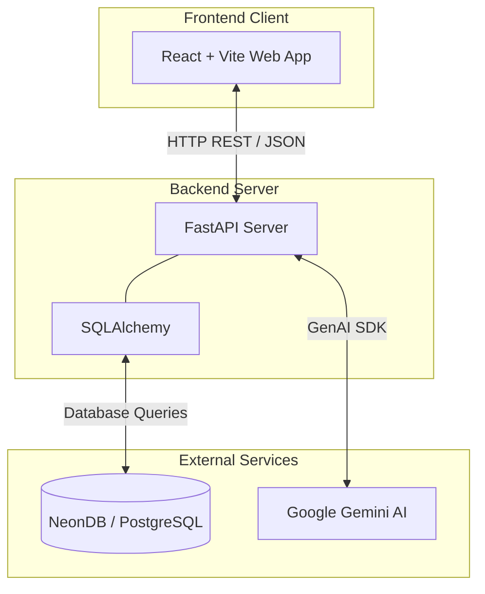

# Classroom Management System


A modern, full-stack Classroom Management System designed to streamline academic management through role-based dashboards, attendance tracking, assignment management, grade reporting and a fully integrated AI-powered assistant.

## ✨ Features

- **Role-Based Access Control:** Dedicated, highly customized dashboards for Students, Teachers and Administrators.
- **Attendance & Grades:** Seamless tracking and monitoring for both students and faculty.
- **Assignment Hub:** Teachers can create, assign, and grade homework, while students can track due dates and submit work.
- **AI Chatbot Integration:** Built-in AI assistant powered by Google Gemini, offering role-aware contextual help (e.g., study tips for students, lesson planning for teachers).
- **Responsive UI:** Beautiful, modern, and highly responsive user interface with a sleek dark mode option.

---

## 🏛️ System Architecture



---

## 🛠️ Tech Stack

| Category | Technology | Purpose |
|----------|------------|---------|
| **Frontend** | React 19 | Component-based User Interface |
| **Build Tool** | Vite 8 | Extremely fast frontend build environment |
| **Styling** | Tailwind CSS v4 | Utility-first responsive CSS styling |
| **Backend** | FastAPI | High-performance asynchronous REST API |
| **Language** | Python 3.14 | Backend programming language |
| **ORM** | SQLAlchemy 2.0 | Database Object Relational Mapping |
| **Database** | NeonDB (PostgreSQL) | Primary serverless data storage |
| **AI Services** | Google Gemini | Intelligent Chatbot and contextual assistance |


---

## 🚀 Running the Project Locally

### 1. Clone the repository
```bash
git clone https://github.com/KshitijSharma19/Classroom_Management_System.git
cd Classroom_Management_System
```

### 2. Backend Setup
Navigate to the backend directory and set up the Python environment:
```bash
cd backend
python -m venv venv
.\venv\Scripts\activate  # On Windows
pip install -r requirements.txt
```

**Configure API Keys:**
Create a `.env` file in the `backend` directory and add your Google Gemini API key:
```env
GEMINI_API_KEY=your_actual_api_key_here
```

**Start the Backend Server:**
```bash
uvicorn main:app --reload
```
The API will run on `http://127.0.0.1:8000`.

### 3. Frontend Setup
Open a new terminal, navigate to the frontend directory, and install dependencies:
```bash
cd frontend
npm install
```

**Start the Development Server:**
```bash
npm run dev
```
The web app will run on `http://localhost:5173`.

---

## 🤖 AI Chatbot

For security reasons, the Gemini API key is **not included** in this repository. 
To use the chatbot, generate your own Gemini API key from [Google AI Studio](https://aistudio.google.com/app/apikey) and add it to `backend/.env`. If the key is missing, the application will still function perfectly, but the chatbot will gracefully notify you that it needs a key.

---

## 👨‍💻 Author

**Kshitij Sharma**
